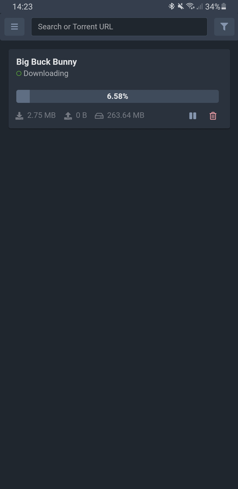
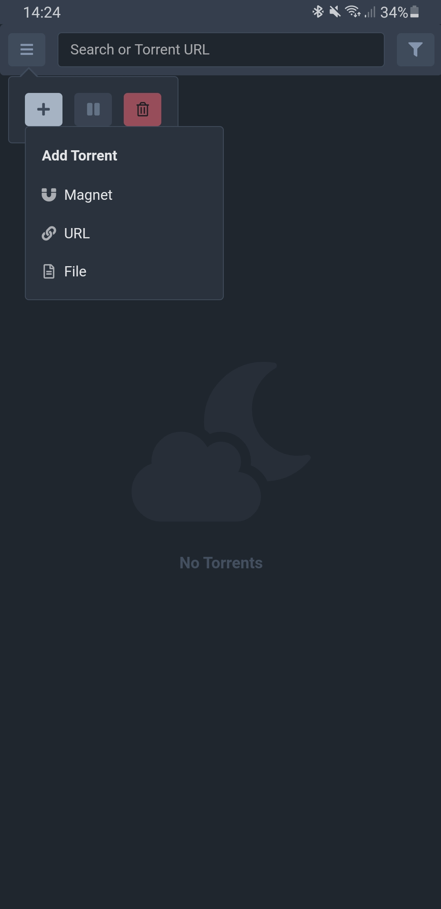
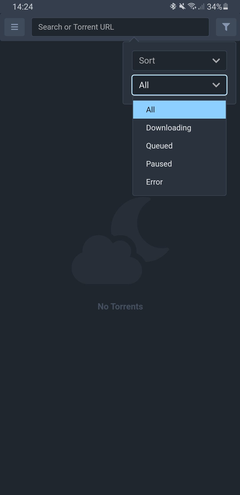

<p align="middle"></p>


> You probably have a whole [media stack](https://github.com/relvacode/mediastack) for managing your _legitimate_ media files remotely.
>
> Sometimes though, downloads can get stuck or you want to add something manually to your Torrent client. Deluge's WebUI whilst powerful is pretty much useless on mobile devices.
>
> Introducing __Storm__
>
> A slick remote interface for Deluge that fully supports mobile devices (including as a home-screen app)

&nbsp;

<p float="left" align="middle">



</p>

#### Usage

```
docker run --name storm \
  --network deluge \
  -p 8221:8221 \
  -e DELUGE_RPC_HOSTNAME=deluge \
  -e DELUGE_RPC_USERNAME=username \
  -e DELUGE_RPC_PASSWORD=password \
  relvacode/storm
```


The recommended way to run Storm is with a Docker image. 

You'll need a Deluge container running with a valid [auth configuration](https://dev.deluge-torrent.org/wiki/UserGuide/Authentication). 
Storm needs a way to contact the Deluge RPC daemon so it's best that you create a [Docker network](https://docs.docker.com/engine/tutorials/networkingcontainers/) and attach the Storm container to that network.

Once that's setup you'll need to configure Deluge to allow remote RPC connections:

Open up `core.conf` in your Deluge configuration folder and set

```
"allow_remote": true
```

Then you can use the following environment variables to configure Storm

| Environment | Description |
| ----------- | ----------- |
| `DELUGE_RPC_HOSTNAME` | The Deluge RPC hostname |
| `DELUGE_RPC_USERNAME` | The username from Deluge auth |
| `DELUGE_RPC_PASSWORD` | The password from Deluge auth |
| `DELUGE_RPC_VERSION` | `v1` or `v2` depending on your Deluge version |


__Important__

Storm does not come with authentication built-in. It is highly recommended you use a proxy container like [oauth2-proxy](https://github.com/oauth2-proxy/oauth2-proxy) or NGINX with basic auth credentials to provide authentication when serving Storm over the internet.
